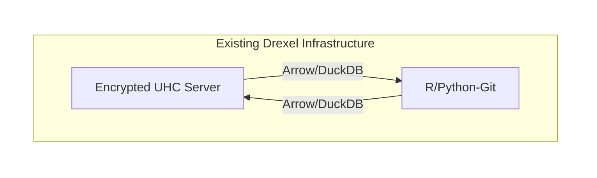

# HCUP Extraction Loading

This repo contains codebase for extraction raw HCUP data via HCUP load scripts then loading them as parquet onto our UHC server. This is the **EL** part of our ELT pipeline. The **T**ransformation is organized in a data warehouse repository found at the [hcup-dbt repo](https://github.com/Drexel-UHC/hcup-dbt).

Please visit this [repository's GitHub page](https://drexel-uhc.github.io/hcup-extraction-loading/) for additional details.

## Folders 
This folder contains our data pipeline.

- `📁 extraction-loading` contains codebase for the extraction of raw data from HCUP  (.acs) via Stata .Do scripts into (.dta) and subsequent loading into our database as both .csv codebooks and .parquet data files.
- `📁 quarto` contains codebase for our HCUP project documentation website.
- `📁 docs` contains supporting documents including presentations or third party documentation. 

## ELT (Extraction Loading Transform) schematic


```mermaid
graph LR
classDef subgraph_padding fill:none,stroke:none
 subgraph lan [ELT]
 subgraph subgraph_padding1 [ ]
   style lan stroke-dasharray: 5 5
         subgraph  <b>E</b>xtraction
           n1[.acs]--Stata load program-->n2[.dta]
         end
         n2[.dta]---n3[.dta]
         subgraph <b>L</b>oading
           n3[.dta]--R-->n4[.parquet]
         end
         n4[.parquet]---n5[.parquet]
         subgraph <b>T</b>ransformation
            n5[.parquet]--R+DuckDB-->n6[analytical_files]
        end
        end
 
 end       
 class subgraph_padding1 subgraph_padding
```

## Infrastructure Summary


